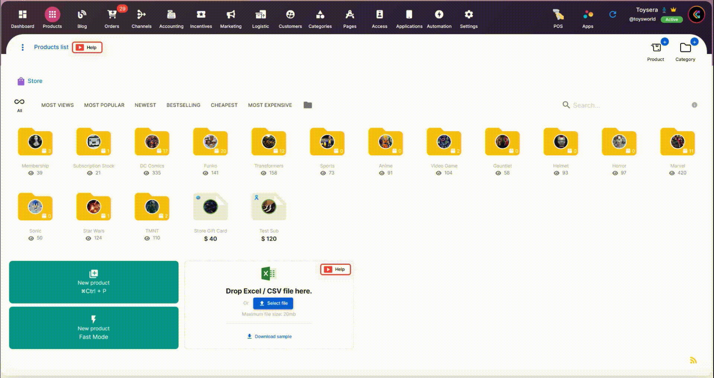

# Excel | Bulk Import Template Files

_Simplify Your Selldone Shop Experience with Free Excel Templates for Bulk Product Uploads_

## Why bulk import?

Managing an online store can be a daunting task, especially when it comes to adding and updating a large number of
products. To streamline this process for Selldone shop users, we have introduced a free Excel template files repository
that simplifies bulk product uploads.

These user-friendly Excel templates are designed to help you quickly and efficiently add or update product information
in your Selldone shop. With clearly labeled fields for product details such as title, description, price, SKU, and more,
you can easily organize and maintain your inventory.

## How use it?

To get started, simply download the appropriate template from our repository, fill in your product information, and save
the file. Next, upload the Excel file to your Selldone shop > Products (Drag & Drop), and watch as your products are
automatically added or
updated in your store.

🎥 Youtube: https://youtu.be/fREaoivgq0g

By using our free Excel templates for bulk product uploads, you can save valuable time and effort while ensuring that
your Selldone shop is always up to date and ready to serve your customers.

## List

| File                             | Description                                                                                                                                            |
|----------------------------------|--------------------------------------------------------------------------------------------------------------------------------------------------------|
| **Wholesale with tiered prices** | Efficiently import numerous products with various pricing levels, establish minimum and maximum order constraints per cart, and upload product images. |

<pre>
⊂_ヽ
　 ＼＼ SΞL
　　 ＼(　ˇωˇ)L
　　　 >　⌒ヽD
　　　/ 　 へ＼Θ
　　 /　　/　＼＼N
　　 ﾚ　ノ　　 ヽ_つΞ
　　/　/
　 /　/|
　(　(ヽ
　|　|、＼
　| 丿 ＼ ⌒)
　| |　　) /
`ノ )　　Lﾉ
</pre>
